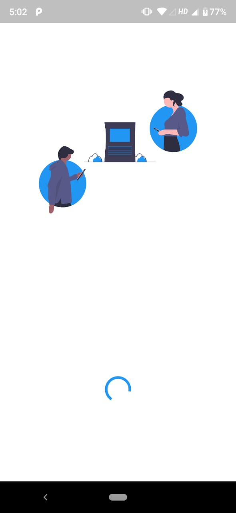
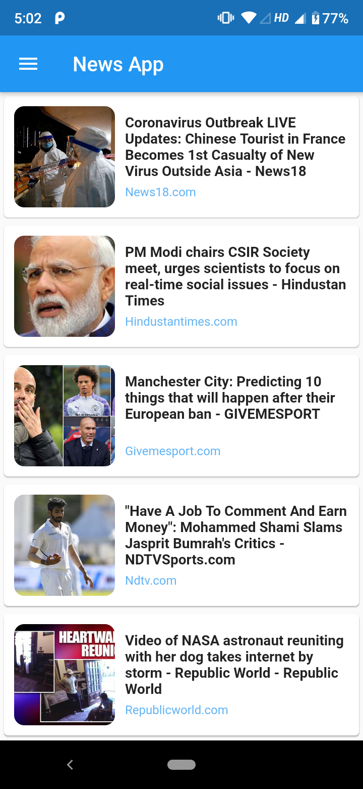
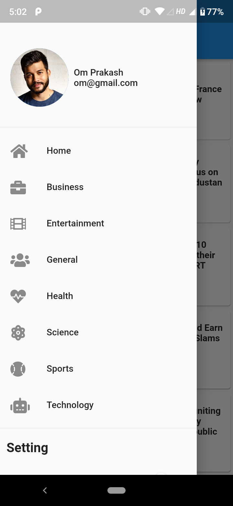
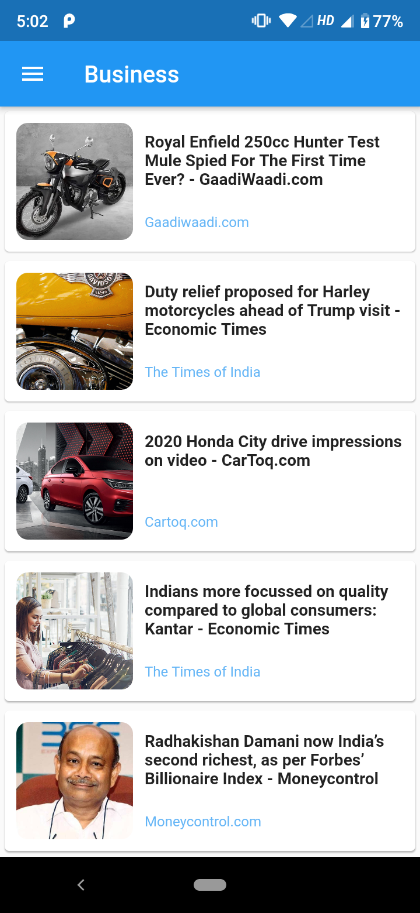
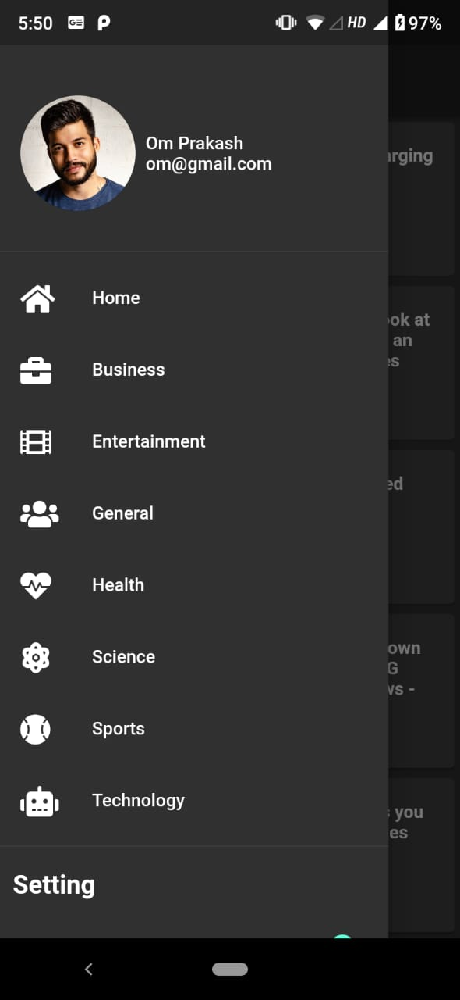

# News App
News app is flutter base project. In this app user can read news headlines by category wise form the internet. 
API use in this project [News.org](https://newsapi.org).

#### API Key Note
You need to insert your API key.
Go to a file named `MyHomePage.dart` and find the value of apiKey.
Replace "test" with "YOUR-API-KEY".
```
String apiKey = 'YOUR-API-KEY';
```

### Features

* Splash screen
* Navigation Drawer
* Share news
* Read news
* Open full news in web browser
* Dynamic Theme

### ScreenShots
<p>








</p>